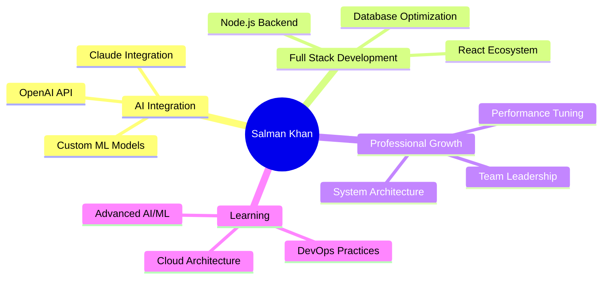

# <div align="center">👋 Hi there, I'm **Salman Khan**</div>

<div align="center">
  
</div>

<div align="center">
  
</div>

## <div align="center">🚀 **About Me**</div>


```typescript
const salmanKhan = {
    location: "Peshawar, Pakistan 🇵🇰",
    role: "Full Stack Developer",
    experience: "4+ years",
    education: "BSCS @ Islamia College Peshawar",
    
    currentlyWorking: [
        "AI-Driven Data Collection Platform",
        "Customer Support Dashboard with AI",
        "Learning Management System"
    ],
    
    passions: [
        "Building scalable applications",
        "AI/ML Integration",
        "Modern web technologies",
        "Open source contribution"
    ],
    
    askMeAbout: [
        "Full Stack Development",
        "React/Next.js", 
        "AI Integration",
        "System Architecture"
    ]
};
```

<br clear="right"/>

## <div align="center">💼 **Professional Experience**</div>

<div align="center">
  
</div>

### 🏢 **BAVE TECHNOLOGIES** | *Full Stack Developer* | `2024 - Present`

<details>
<summary><b>🎯 Key Projects & Achievements</b></summary>

#### 🤖 **AI-Driven Data Collection Platform**
- Built comprehensive React frontend for AI-powered data scraping
- Integrated multiple AI models: OpenAI, Claude, and custom AI services
- Implemented real-time data visualization and analytics

#### 🎧 **Customer Support Dashboard**
- Developed AI-assisted interface for query management
- Created automated call response systems
- Enhanced UI/UX workflows for improved productivity

#### 📚 **Learning Management System**
- Full-stack Angular/Django application
- Student progress tracking and teacher dashboards
- Parent portal with performance analytics
- Mobile-responsive design across all devices

</details>

### 🚀 **IGNIPULSE** | *MERN & Next.js Intern* | `2023 (4 months)`

<details>
<summary><b>🏆 Notable Projects</b></summary>

- **GlobalTuitions**: Next.js education platform for scalability
- **Exceltants**: MERN project management with real-time collaboration
- **Rate-A-Property**: Property evaluation platform with analytics

</details>

<div align="center">
  
</div>

## <div align="center">🛠️ **Tech Stack & Tools**</div>

<div align="center">

### **Frontend Technologies**
<p>
  
</p>

### **Backend Technologies**
<p>
  
</p>

### **Databases & Cloud**
<p>
  
</p>

### **AI & Development Tools**
<p>
  
  
  
</p>

</div>

<div align="center">
  
</div>

## <div align="center">📊 **GitHub Analytics**</div>

<div align="center">
  
  
</div>

<div align="center">
  
</div>

<div align="center">
  
</div>

<div align="center">
  
</div>

## <div align="center">🏆 **Achievements & Expertise**</div>

<div align="center">

| 🎯 **Specialization** | 📈 **Impact** |
|:---:|:---:|
| **AI Integration** | Multiple AI models integrated in production |
| **Full Stack Development** | 4+ years building scalable applications |
| **Performance Optimization** | Reduced system latency across platforms |
| **Team Collaboration** | Cross-functional team leadership |
| **Modern Web Tech** | Expert in React, Next.js, Angular ecosystem |

</div>

<div align="center">
  
</div>

## <div align="center">🎨 **Featured Projects**</div>

<div align="center">
  
[](https://github.com/salmank56/ai-data-platform)
[](https://github.com/salmank56/customer-support-ai)
[](https://github.com/salmank56/learning-management-system)
[](https://github.com/salmank56/portfolio-website)

</div>

<div align="center">
  
</div>

## <div align="center">💡 **Current Focus**</div>

<div align="center">



</div>

<div align="center">
  
</div>

## <div align="center">📫 **Let's Connect!**</div>

<div align="center">
  <a href="mailto:ksalman.dev@gmail.com">
    
  </a>
  <a href="https://salmank56.netlify.app" target="_blank">
    
  </a>
  <a href="https://linkedin.com/in/salman-khan-dev" target="_blank">
    
  </a>
  <a href="tel:+923154954548">
    
  </a>
</div>

<div align="center">
  
</div>

<div align="center">
  
</div>

<div align="center">
  <h3>⭐ From <a href="https://github.com/salmank56">Salman Khan</a> with ❤️</h3>
</div>

<div align="center">
  
</div>
